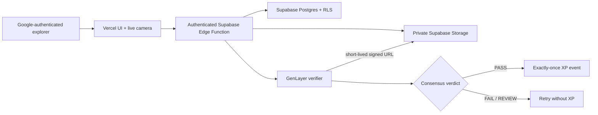

# IRLQuest MVP architecture

## Verification boundary



The boundary follows GenLayer's recommended fit: the backend handles deterministic application work; validators own the subjective visual decision that changes submission and XP state.

### Frontend and API own

- User authentication and camera UX
- Daily assignment scheduling and time zones
- Random nonce/challenge issuance and expiration
- MIME/signature checks, uploads, private media retention, and rate limits
- Fast profile/feed reads, notifications, XP indexing, and admin tools
- Idempotent application of an accepted on-chain verdict

### GenLayer owns

- Binding fetched evidence to its submitted SHA-256 digest
- Whether the visible photo satisfies the immutable quest version
- Whether the randomized live challenge is visible
- Whether evidence is clear enough to judge
- A narrow safety gate
- A replay-resistant, consensus-backed result record

### GenLayer does not prove

- That the browser/device itself is uncompromised
- That GPS is genuine (IRLQuest currently does not need location)
- That an advanced synthetic image is impossible
- That users have not coordinated outside the protocol

High-value financial rewards would require native mobile attestation, stronger liveness, fraud scoring, rate limits, and an appeal system. The MVP intentionally keeps XP non-financial.

## Production persistence

Supabase Postgres owns the production records:

```text
profiles
quests
quest_versions
daily_assignments
proof_sessions
submissions
xp_events
```

Every table has RLS enabled. Users can read only their own profile, assignments, sessions, submissions, and XP; quest definitions are public read-only data. The browser has no direct write policy for evidence. The authenticated Edge Function performs validated uploads and invokes narrowly scoped transaction functions.

`quest_versions` is immutable. Every assignment points to the exact title, XP value, prompt, and verification rules that were active when it was issued. `xp_events.submission_id` is unique, so retries or duplicated callbacks cannot award XP twice. Media lives only in the private `quest-evidence` bucket, never in SQL or public storage.

The local Express server preserves the same responsibilities with SQLite and encrypted/signed local evidence paths. It is a development fallback, not the production backend.

## Submission states

```text
pending assignment
  -> expiring proof session
  -> pending submission / verifying assignment
  -> accepted submission + completed assignment + unique XP event
     OR
  -> rejected/review submission + pending assignment (retry allowed)
```

A proof session is single-use. The backend creates the evidence file before the transaction, then removes it if database insertion fails. Pending verifications are recovered when the server restarts.

## Production hardening

Before attaching financial value or opening a broad public beta:

1. Add per-user/device/IP rate limits, storage quotas, and lifecycle deletion.
2. Add pre-display moderation, reports, appeals, and explicit evidence-retention consent.
3. Exercise the live Bradbury path end-to-end with representative real images.
4. Keep the relayer key only in Supabase secrets and fund it with a bounded testnet balance.
5. Instrument verification latency, disagreement, rejection/appeal rate, and cost per accepted quest.
6. Add native app attestation before making XP transferable or financially valuable.
